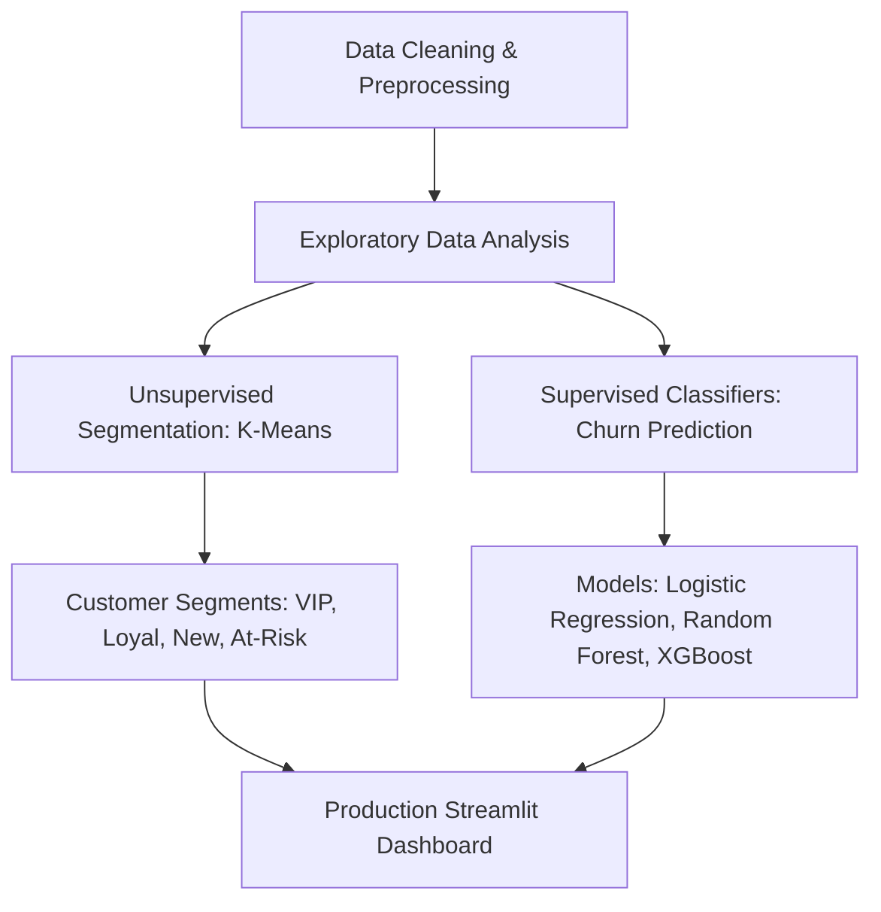

# Telco Customer Analytics: Customer Segmentation & Churn Prediction

An end-to-end production-ready Data Science portfolio project combining **Unsupervised Machine Learning (K-Means Clustering)** for customer segmentation and **Supervised Machine Learning (XGBoost, Random Forest, Logistic Regression)** for churn prediction. This project includes a feature-rich, high-performance **Streamlit Dashboard** that delivers business value by transforming model probabilities into **Revenue at Risk ($)**, displaying **Local Explainability (XAI)**, and providing an **Interactive Database Explorer**.

---

## 📌 Project Overview & Business Problem

In the telecommunications sector, customer retention is a major profit driver. Acquiring new customers costs 5x to 25x more than retaining existing ones. This project provides a double-sided machine learning solution:
1. **Unsupervised Customer Segmentation**: Groups customers using K-Means clustering based on tenure, billing charges, and Customer Lifetime Value (CLTV). This allows marketing teams to design tailored retention campaigns.
2. **Supervised Churn Prediction**: Predicts individual customer churn probabilities in real time. We deploy an **XGBoost Classifier** as the champion model to flag high-risk customers, diagnose the risk drivers, and propose specific discount strategies.

---

## 📊 Dataset Description

The dataset comprises **7,032 customers** with 38 attributes covering:
* **Demographics**: Gender, Senior Citizen status, Partner, Dependents.
* **Services**: Phone service, Multiple lines, Internet service (DSL/Fiber optic/No), Online Security, Online Backup, Device Protection, Tech Support, Streaming TV, Streaming Movies.
* **Account Info**: Contract type (Month-to-month, One year, Two year), Paperless billing, Payment method, Zip Code, City, Tenure (Months).
* **Financials**: Monthly Charges, Total Charges, CLTV (Customer Lifetime Value).
* **Target**: Churn Label (Yes/No).

---

## ⚙️ Methodology



### 1. Preprocessing & Feature Engineering
* Handled missing value distributions (specifically for `Churn Reason` in active customers).
* Binned continuous variables into categories (`Tenure_Group`, `Charge_Group`, `CLTV_Group`).
* Standardized features for K-Means using `StandardScaler`.
* Transformed categorical columns into numerical representations using dummy encoding.

### 2. Customer Segmentation (Unsupervised)
We fit a K-Means model ($k=4$) on tenure, charges, and CLTV. The resulting clusters are mapped to business personas:
* 🌟 **VIP Customers**: Long-term subscribers, premium spenders, very high CLTV.
* 🤝 **Loyal Customers**: Stable, long-term customers with lower monthly spending.
* 🆕 **New Customers**: Recently acquired users with high potential value but high early-stage churn risk.
* ⚠️ **At-Risk Customers**: Low-to-medium tenure, moderate-to-high spend, low CLTV, and highly prone to churn.

---

## 📈 Model Performance & Benchmarks

All models were evaluated on a stratified 20% test set. The model benchmarks are:

| Model | Accuracy | Churn Recall | Churn F1-Score | Business Advantage |
| :--- | :---: | :---: | :---: | :--- |
| **XGBoost (Champion)** | **80.24%** | **58.00%** | **61.00%** | **Best overall accuracy and F1 score; robust prediction** |
| **Logistic Regression** | 79.67% | 57.00% | 60.00% | Highly interpretable coefficients and fast inference |
| **Random Forest** | 79.39% | 49.00% | 56.00% | Lower variance, robust to outlier inputs |
| *Balanced Logistic* | 75.10% | *78.00%* | 59.00% | Maximizes recall to catch more churners for proactive campaigns |

### Top Churn Drivers
1. **Contract Type**: Month-to-month contracts represent the highest risk.
2. **Internet Service Type**: Fiber optic connection users show high sensitivity to premium billing rates.
3. **Tenure Months**: Low tenure indicates onboarding and customer success gaps in the first year.
4. **Lack of Tech Support & Online Security**: These value-added services build customer stickiness and product dependency.

---

## 🖥️ Dashboard Features

The dashboard includes 7 interactive pages:
1. **Executive Summary**: KPI metrics (Total Customers, Churn/Retention rates, Revenue, average CLTV) and segment summaries.
2. **Exploratory Data Analysis**: Interactive Plotly histograms, bar charts, and heatmaps for churn correlates.
3. **Customer Segmentation**: Profiling clusters in an interactive 2D feature space.
4. **Churn Prediction Playground**: Real-time customer risk assessment, comparing XGBoost, Random Forest, and Logistic Regression side-by-side. Includes:
   * **Financial Risk Quantification**: Computes the exact monthly and annual revenue at risk ($) for the customer.
   * **Local Explainability (XAI)**: Diagnoses the specific account risk drivers and retention anchors.
   * **ROI Simulator**: Calculates the cost/benefit ratio of offering a contract-upgrade discount.
5. **Feature Importance & XAI**: Visualizing global model coefficients and explaining feature importance.
6. **Raw Database Explorer**: Interactive cohort builder. Recruiter/Analyst sandbox that allows filtering by segment/churn/contract and running custom pandas queries. Supports CSV export.
7. **Business Recommendations**: Action plans for retention, pricing, and customer success teams.

---

## 🚀 Installation & Local Execution Guide

### Prerequisites
* Python 3.9+
* git

### Installation
1. Clone this repository:
   ```bash
   git clone https://github.com/DheerajRajbhar/Telco-Customer-Analytics.git
   cd Telco-Customer-Analytics
   ```
2. Set up a virtual environment:
   ```bash
   python -m venv venv
   # Activate on Windows:
   venv\Scripts\activate
   # Activate on macOS/Linux:
   source venv/bin/activate
   ```
3. Install the required libraries:
   ```bash
   pip install -r requirements.txt
   ```
4. Start the Streamlit application:
   ```bash
   streamlit run app.py
   ```
5. Open `http://localhost:8501` in your web browser.

---

## ☁️ Streamlit Community Cloud Deployment Guide

1. Push this project folder to your GitHub repository.
2. Navigate to [Streamlit Community Cloud](https://share.streamlit.io/).
3. Click **New app**, then select your repository, branch (`main`), and main file path (`app.py`).
4. Click **Deploy**. Streamlit Cloud will automatically install dependencies using `requirements.txt` and system packages using `packages.txt`.

---

## 🔮 Future Improvements
* **Dynamic Re-clustering**: Schedule periodic K-Means re-fitting via GitHub Actions to capture shifting customer behavior.
* **SHAP Integration**: Replace custom explainability heuristics with full SHAP force plots for prediction-level explanations.
* **A/B Testing Simulator**: Create a dashboard tab to track the statistical outcomes of discount retention campaigns.

---

## 📄 License
This project is licensed under the MIT License - see the [LICENSE](LICENSE) file for details.

---

## ✍️ Author Information
* **Name**: Dheeraj Rajbhar
* **Role**: Data Scientist / ML Engineer
* **GitHub**: [@DheerajRajbhar](https://github.com/DheerajRajbhar)
* **LinkedIn**: [Dheeraj Rajbhar](https://www.linkedin.com/in/dheerajrajbhar/)
